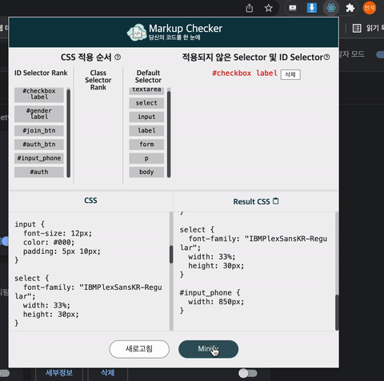

# Markup-Chrome-extension

📃 마크업 판별 크롬 익스텐션

## 😋 프로젝트 설명

- 크롬 익스텐션으로 구현 된 개인 프로젝트 및 개발자를 위한 개발자 도구
- 웹 퍼블리셔 및 마크업 개발자 등 웹에 관련된 작업을 하는 개발자에게 쉽게 디버깅을 제공하는 개발자 도구
- 학습 시간이 부족한 개발자에게 자동화 방식으로 쉽게 오류의 원인을 파악 할 수 있고, 시각화 자료로 제공해 누구나 쉽게 디버깅
- 디버깅 도구가 제공되지 않는 일부 마크업 영역에서 도움을 줄 수 있습니다.

## 🖥 DEMO

- 마크업 파일 추가/중복 및 미적용 선택자 제거 기능, 선택자 우선 순위 리스트/Minify 기능 및 효율성 검사 기능

## 👨🏻‍💻 제작 과정

- 30일 진행
- 2021-05 ~ 2021-06

## 📚 개발 기술

- HTML5/CSS3
- JavaScript
- React
- OpenLibrary
  - Specifity API

## 🔨 기능

- [x] 선택자 적용 순서 리스트 출력
  - [x] 사용자에게 점수에 따른 선택자 적용 순서 제공
- [x] 적용되지 않는 선택자 리스트 출력
  - [x] 오버라이딩 되어서 적용 되지 않는 선택자 제공
- [x] 선택자 Clear 기능 제공
  - [x] 적용되어 있지 않는 선택자 정리 및 정렬 기능 제공
- [x] minify 기능 및 클립 보드 복사 기능 제공
  - [x] 효율적인 코드 개선을 위한 minify 기능 및 코드 개선 효과 데이터 값 출력
  - [x] 간편하고 효율적인 사용을 위한 클립 보드 복사 기능 제공
